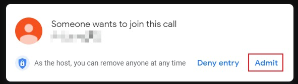
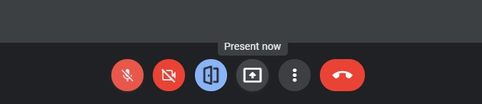

# Multi language support

## Why Auto Admit is limited to several languages:
1. Auto Admit find a button with a keyword such as 'admit' and '接受' then click on it.

2. Auto Admit also find the button with 'Present now' or '立即分享螢幕畫面' label and add a admit button to it.

3. Auto Admit will detect your **browser language** and decide which set of keywords should be used. The keywords need to be added using JSON files in the `_locales` folder. 
4. Hence, if your browser language is not supported, Auto Admit will try to look for the 'admit' button. If no button is found, things will not works!

## Edit the bookmarklet for your own use:
This is the content of the bookmarklet:
```javascript
javascript:
var admit = 'ADMIT_KEYWORD';
button_added = document.getElementById('auto-admit-div');
var toggle;
if(button_added == null){
    Initialize();
}else{
    Toggle();
}
function Initialize(){
    var newdiv = document.createElement('div');
    newdiv.id = 'auto-admit-div';
    newdiv.style.display = 'none';
    button_added = document.body.appendChild(newdiv);
    Toggle();
    setInterval(Update, 500);
}
function Update() {
    if(toggle){
        for (let element of document.getElementsByTagName('span')) {
            if (element.innerHTML === admit){
                element.click();
            }
        }
    }
}
function Toggle(){
    button_added.classList.toggle('on');
    toggle = button_added.classList.contains('on');
    alert('Auto admit turned '+(toggle?'on':'off'));
}
```
Simply replace the `ADMIT_KEYWORD` with the display text in your language☺.

## Help me to support other languages!
Everyone is welcome to translate Auto Admit to other languages. If you want to do so, simply add issues, or make pull requests if you know how to edit the locales file.