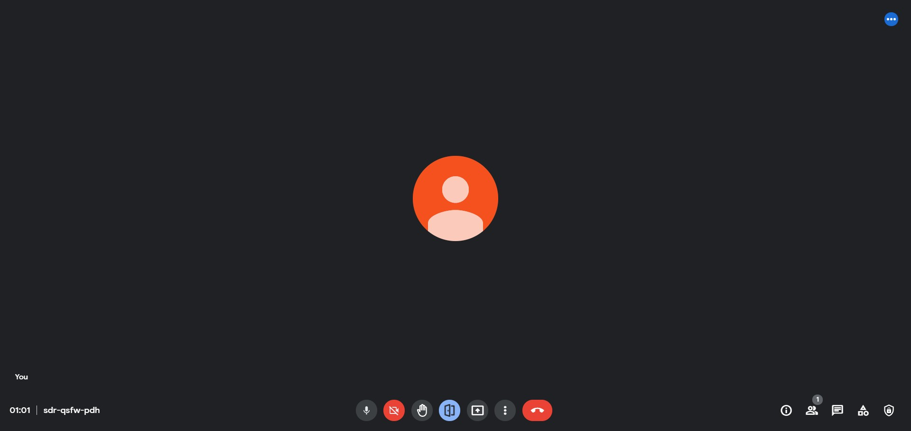

## Auto admit for Google meet

### Chrome Extension:

- ONLY support Chinese traditional and English! If you need any other languages supported, please read [HERE](language_support.md).
- Make sure that your browser and google meet UI are both set to ZH-TW/EN, otherwise, the extension will not work.
- <a href="https://github.com/fjwntut/auto-admit-extension/raw/main/AutoAdmit.zip" Download>Download Auto Admit</a>
- Installation： 
    1. Extract the zip
    2. Go to [chrome://extensions/](chrome://extensions/)
    3. open developer mode
    4. load unpack.
- When you started a meeting, the extension generates a button in the bottom bar. You could use the button to toggle auto admit on/off.
- You can also click on the extension icon to toggle it on/off.
- This extension only works when you keep the Google Meet tab opened.

### Bookmarklet: 
- English: <a href="javascript:var admit = 'admit';button_added = document.getElementById('auto-admit-div');var toggle;if(button_added == null){    Initialize();}else{    Toggle();}function Initialize(){    var newdiv = document.createElement('div');    newdiv.id = 'auto-admit-div';    newdiv.style.display = 'none';    button_added = document.body.appendChild(newdiv);    Toggle();    setInterval(Update, 500);}function Update() {    if(toggle){        for (let element of document.getElementsByTagName('span')) {            if (element.innerHTML === admit) {                console.log('There is someone waiting to join this meeting, automatically admitting them...');                element.click();            }        }    }}function Toggle(){    button_added.classList.toggle('on');    toggle = button_added.classList.contains('on');    alert('Auto admit turned '+(toggle?'on':'off'))}">Auto Admit</a> 
- Chinese: <a href="javascript:var admit = '接受';button_added = document.getElementById('auto-admit-div');var toggle;if(button_added == null){    Initialize();}else{    Toggle();}function Initialize(){    var newdiv = document.createElement('div');    newdiv.id = 'auto-admit-div';    newdiv.style.display = 'none';    button_added = document.body.appendChild(newdiv);    Toggle();    setInterval(Update, 500);}function Update() {    if(toggle){        for (let element of document.getElementsByTagName('span')) {            if (element.innerHTML === admit) {                console.log('There is someone waiting to join this meeting, automatically admitting them...');                element.click();            }        }    }}function Toggle(){    button_added.classList.toggle('on');    toggle = button_added.classList.contains('on');    alert('Auto admit turned '+(toggle?'on':'off'))}">Auto Admit</a> 
-  If you need any other languages supported, please read [HERE](language_support.md).
- Installation： Drag the link above to your bookmark bar to use.
- To toggle Auto Admit on / off simply click the bookmark.
- The script only work when the google meet tab is opened.
 
### Github Repo
[fjwntut/auto-admit-extension: Auto admit extension for google meet](https://github.com/fjwntut/auto-admit-extension)
